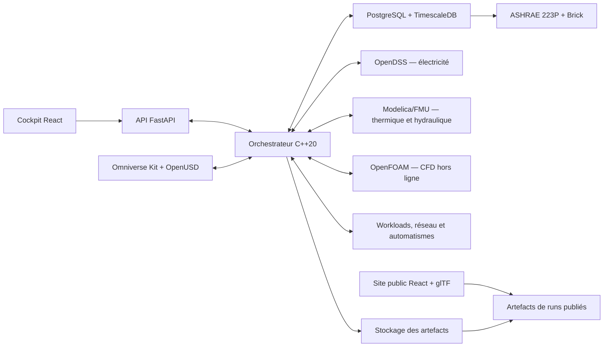

# Data Center Digital Twin

> Statut : fondation du projet — la spécification est actée, l'implémentation n'a pas encore commencé.

Ce dépôt construit un jumeau numérique multiphysique professionnel d'un data center fictif français orienté AI/HPC. Le produit associera une scène 3D OpenUSD très détaillée, des solveurs spécialisés, une orchestration temporelle, un cockpit d'exploitation et une expérience Web publique légère.

Le data center est un démonstrateur de profondeur technique. La finalité commerciale est plus large : montrer la capacité à numériser, connecter, superviser et simuler des équipements, bâtiments et installations complexes pour de futurs clients.

La référence fonctionnelle et architecturale est la [spécification du projet](docs/specification/PROJECT_SPECIFICATION.md). Les instructions obligatoires pour les agents et contributeurs sont dans [AGENTS.md](AGENTS.md). Claude Code doit également lire [CLAUDE.md](CLAUDE.md).

## Ce que le produit doit prouver

Le jumeau doit relier une représentation spatiale et sémantique aux comportements réels des systèmes. Il doit calculer l'électricité depuis l'arrivée HTA jusqu'aux baies, le refroidissement par air et liquide, la charge informatique issue des workloads, les automatismes, les alarmes, la sécurité et les interventions humaines.

Une panne ne sera pas une animation préparée. Le scénario injectera une cause, puis les modèles calculeront la propagation, les délais, les protections, les réactions automatiques et les conséquences sur les services informatiques.

## Architecture de référence



OpenUSD compose la scène et Omniverse Kit l'affiche avec le rendu RTX. Ils ne calculent pas la physique. Le moteur C++ possède l'horloge virtuelle et orchestre les domaines. OpenDSS calcule le réseau électrique RMS, Modelica les dynamiques thermohydrauliques et OpenFOAM les campagnes CFD détaillées. PostgreSQL conserve les identités et configurations canoniques, tandis que TimescaleDB conserve les séries temporelles.

Le site public ne lancera ni Kit ni les solveurs. Il chargera une scène glTF/GLB optimisée et rejouera des résultats pré-calculés, validés et expurgés. Les démonstrations haute fidélité utiliseront Kit desktop ou une session WebRTC temporaire.

## Principes non négociables

La 3D n'est jamais la source de vérité d'un raccordement ou d'un calcul. Chaque actif possède une identité canonique stable et chaque représentation externe s'y rattache explicitement.

Les données synthétiques, observations réelles, commandes, états et résultats simulés restent séparés. Une courbe, probabilité, tolérance ou mesure ne doit jamais être inventée ou présentée avec un niveau de preuve qu'elle ne possède pas.

Chaque modèle déclare son usage, ses hypothèses, son domaine de validité et ses preuves. Chaque run est immuable et reproductible. Chaque conséquence importante doit être explicable par une cause, un état, une commande ou une règle identifiée.

Le site public, l'ingénierie, la simulation et toute future connexion OT sont séparés. Les connecteurs réels sont en lecture seule par défaut et aucune commande réelle ne peut provenir d'un scénario de démonstration.

## Surfaces du produit

L'application d'ingénierie associera Omniverse Kit à un cockpit React pour inspecter les actifs, systèmes, résultats, alarmes, procédures et timelines causales. Elle fonctionnera d'abord localement sur le poste actuel avec des payloads, niveaux de détail et modèles réduits adaptés.

La vitrine publique présentera un parcours guidé et une exploration libre avec React Three Fiber, glTF/GLB, courbes et explications. Elle conservera une alternative accessible si la 3D avancée n'est pas disponible.

## Organisation cible

```text
apps/          cockpit d'ingénierie, site public et application Kit
services/      orchestrateur C++, API et service sémantique
adapters/      OpenDSS, Modelica, OpenFOAM et futures télémétries
packages/      contrats, schémas et composants partagés
models/        modèles électriques, thermiques, IT, contrôle et humains
assets/        sources, USD, dérivés Web et matériaux
data/          données de référence, synthétiques et de validation
database/      migrations, seeds et politiques
infra/         environnement local, observabilité et déploiement
tests/         tests unitaires, contrats, intégration et scénarios
docs/          spécification, ADR, dossiers de modèles et rapports
tools/         pipelines d'assets, publication et validation
```

Cette arborescence sera créée progressivement. Un dossier ne sera ajouté que lorsqu'un premier contenu réel le justifie.

## Première tranche verticale

La première tranche représentera une zone de data hall avec baies classiques et IA, une chaîne électrique représentative, une branche de refroidissement par air, une branche liquide avec CDU, les automatismes essentiels et un cockpit minimal.

Le scénario de référence injectera la perte du réseau public pendant une charge informatique représentative. Le système calculera le passage sur UPS, l'évolution des batteries, le démarrage des groupes, la disponibilité du refroidissement, la température, les alarmes, les réactions des workloads et l'intervention humaine.

## Ordre de construction

La fondation commencera par les contrats, le registre canonique, PostgreSQL/TimescaleDB, un moteur C++ minimal, l'API, une application Kit vide et un cockpit React connecté. Viendront ensuite la tranche sémantique et 3D, l'électricité, le refroidissement hybride, l'informatique, les automatismes et humains, le scénario transversal, l'expérience d'ingénierie, puis la publication Web et l'extension du cycle de vie.

La feuille de route détaillée et les critères d'acceptation se trouvent dans la spécification. Aucun calendrier n'est annoncé avant l'estimation du backlog et la mesure des premiers prototypes.

## Démarrage du développement

Le bootstrap technique n'est pas encore créé. Il n'existe donc volontairement aucune commande de build prétendument fonctionnelle dans ce README. La première modification d'implémentation devra fournir un environnement reproductible, une commande de vérification et un premier run minimal traçable.

Avant de contribuer, lire la spécification et `AGENTS.md`, vérifier l'état Git, identifier la source de vérité affectée et définir le test qui prouvera le changement. Une capacité n'est terminée que lorsque son code, ses tests, ses migrations, sa documentation, ses performances et ses limites sont cohérents.

## Relation avec NVIDIA DSX

Le dépôt `omniverse-dsx-blueprint-for-ai-factories` reste séparé et sert uniquement de référence technique. Ce projet ne dépendra pas de son interface et ne copiera pas ses assets ou son code sans vérification explicite de la licence et de la nécessité.

## Sécurité, confidentialité et licences

Ne jamais committer de secret, donnée client, plan sensible, résultat propriétaire ou asset sans licence. Les données du site de référence sont fictives ou publiquement justifiables et leur provenance doit être conservée.

La licence du nouveau projet n'est pas encore choisie. En l'absence de fichier `LICENSE`, aucun droit de réutilisation publique ne doit être supposé.
